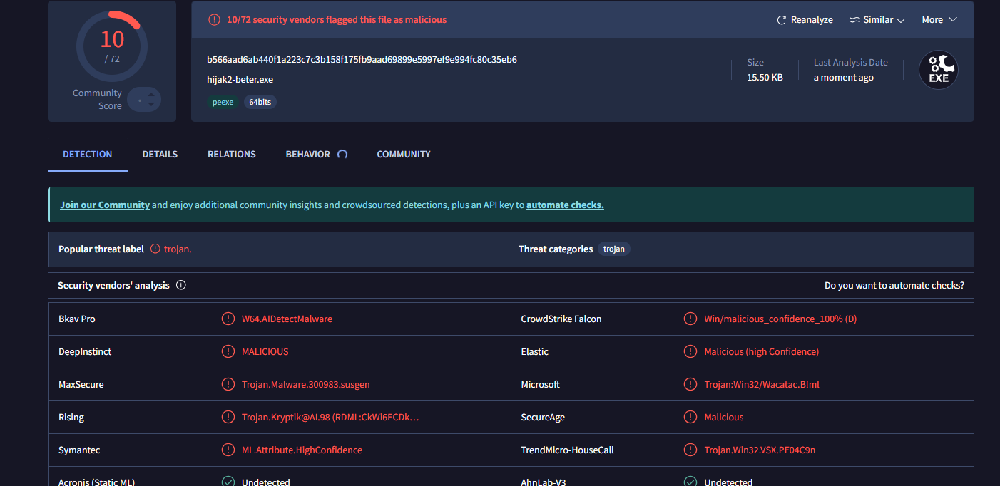
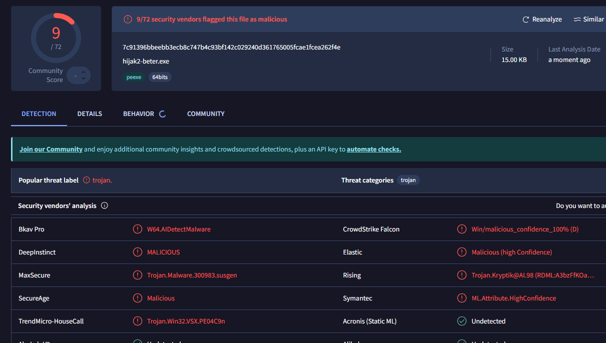
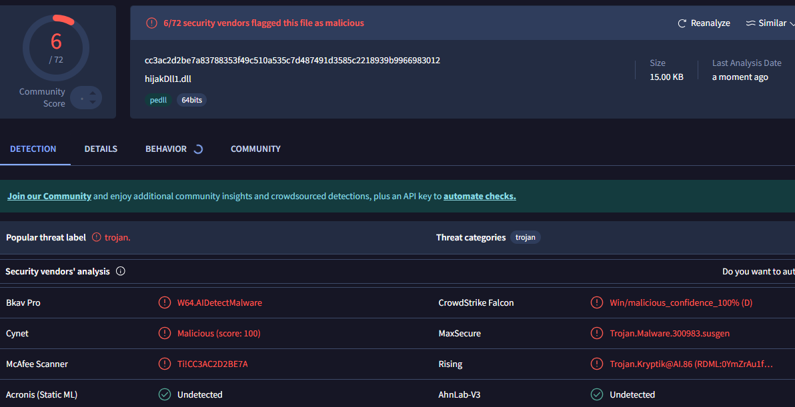
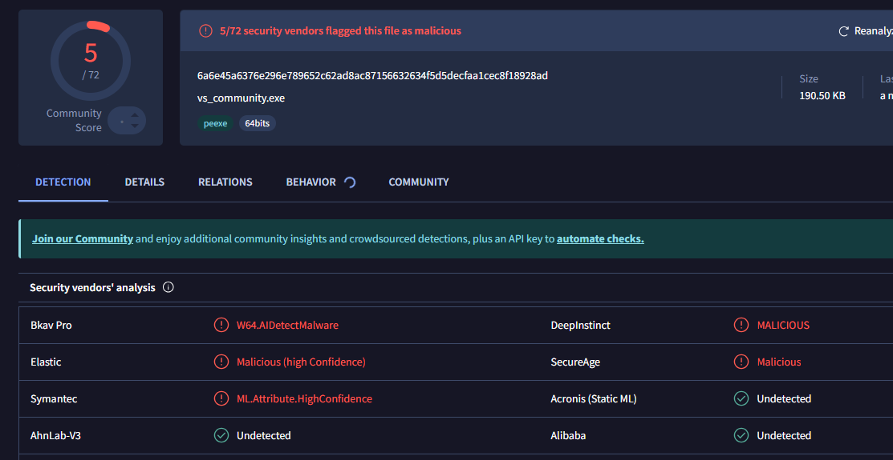
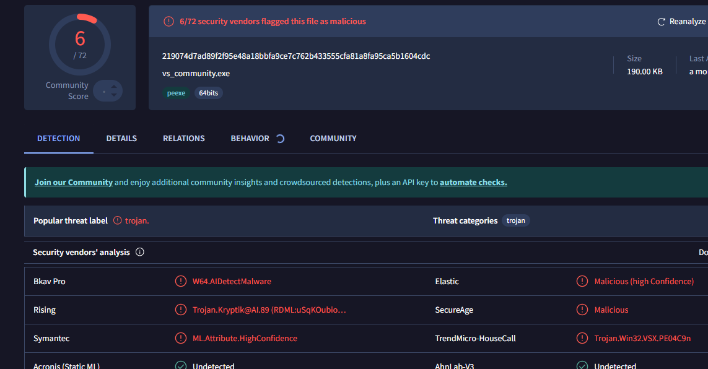

# Thread Hijacking Collection
Collection of Thread Hijacking malware with different techniques. This code is for educational purposes only, do not use it for any malicious or unauthorized activity.

# 💻 Code

It's a simple shellcode injection into a thread of a target process, the shell is a simple msgbox that says "xd", here's how it works:

First the shellcode is decrypted, for a better view of the encryption mechanism check it out [here](https://github.com/Hue-Jhan/Simple-shellcode-crypter), then the code takes a handle to the target process and finds a thread inside it. Once a thread is found/created, the program will allocate memory for the payload, upload the shellcode in it, and change its permissions to RWX.

Now we get to the actual execution: first we suspend the thread, then we change its instruction pointer to make it point to our payload, and we resume the thread. There are multiple ways of achieving this kind of execution, here are the ones i made:

### 1) Find an existing thread
As previously explained, this version finds and hijacks an already existing thread inside a target process, this could be dangerous as the thread in question might hold sensitive operations, there is a high chance that after executing our new payload the process might crash, because it cannot function without the thread we hijacked.  



In order to do this we can use ```CreateToolhelp32Snapshot()``` to list all existing processes, once we find the one that matches the name, we save its pid and we get a handle with ```OpenProcess()``` with the correct permissions.

Then we do the same thing but iterating through all the threads of our system, and we target the first thread whose owner is the process we targeted earlier. We save its Tid and get a handle with ```OpenThread()```. 

After handling the payload part which i described earlier, we suspend the thread, change its RIP to point to the payload, and resume it. After executing the payload and closing the reverse shell, the thread will end and most likely crash the process, but this won't really matter because in the meanwhile you can achieve persistance and open the shell somewhere else.

You could technically save the ctx.Rip and manually restore it after the shellcodes finishes executing, but it's very complex as you have to somehow signal ```WaitForSingleObject()``` that the shellcode is done executing (after having achieved persistance) via ```CreateEvent``` or something similar, you can do this with a custom shell, but didn't wanna waste time so i used Meterpreter and Havoc Daemon pre-built shellcodes. I tried making my own shellcode [here](https://github.com/Hue-Jhan/Custom-Reverse-Shell-cpp) but most of the times the shell didn't activate or it randomly crashed.

### 2) Create a new thread
This version is slighly different as it creates a new thread, it's less stealthy but it won't crash the program after closing the shell. The only differences are: 

- We do not iterate through every thread but simply create an already suspended one with ```CreateRemoteThread()```, in order for it to open successfully we make the base address point to a dummy function that does nothing (later we are going to hijack it anyways);
- When hijacking the thread, it's already suspended.

This version is more likely to be detected because it uses a more detectable injection pattern: "creating a new thread after allocating some memory, copying some freshly decrypted piece of code in it, and making it executable". At least the process won't crash because we did not hijack one of its fundamental threads.

### 3) DLL



This version is a DLL that contains both versions, you need to comment/uncomment a couple of chuncks of code (already highlighted) to use the preferred version. You can inject this dll with one of my injectors ([this](https://github.com/Hue-Jhan/Remote-Dll-injector-Trojan) one, [this](https://github.com/Hue-Jhan/Ntdll-Dll-Injection-Trojan) one, or [this](https://github.com/Hue-Jhan/Direct-Syscall-Dll-Injection) one), or with your own.

The difference is simply that once the dll is attached to a process, it will start a new thread that will function as the "main" function of the previous samples. The new thread outside the loader lock is essential to avoid deadlock. You also might want to disable precompiled headers to remove the phc files. 

# 🛡 AV Detection

Most of the samples are undetected by Windows Defender but will easily get blocked by BitDefender except for the Dll. Here are the samples i obfuscated with resource Hacker by injecting metadata of other apps.





On the left Find&hijack version, on the right Create&hijack version, both injected with vs_community.exe

<br> </br>

Here is the DLL with both (injecting ntdll.dll), but keep in mind that the injector must be undetected too


